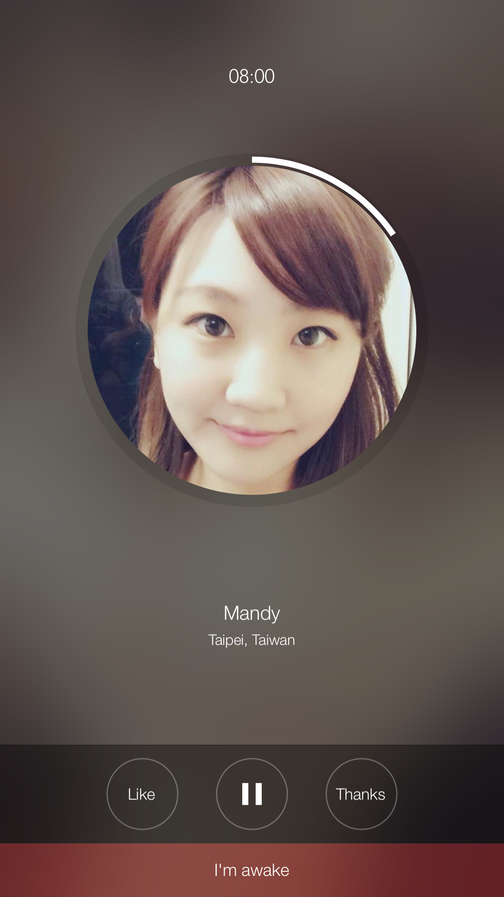

# App Store Preview
```
此 App 只能透過 iPhone 的 App Store 取得。
```
  

## iWaker - 陌生人鬧鐘 
[XJIMI](https://github.com/xjimi/app_iwaker)    
曾經在「工具程式」類中排名第 4  
免費  
  

## iPhone 截圖
 
 
 
 

## iPhone 截圖
 
 

## 簡介

現在！就讓陌生人來叫您起床吧！  
iWaker 是一款全新型態的鬧鐘應用程式。 
它能讓陌生人叫您起床，也可以讓您叫陌生人起床。  
只要設定好鬧鐘，就會有陌生人來叫您起床，讓您起床更有動力！ 
也可以錄製您想說的話或唱首歌來喚醒陌生人起床 
來吧！現在就用您的聲音，來喚醒這個世界吧！  

iWaker Features：  
• 簡易的鬧鐘設定 滑動「時間軸」來選定時間，按下「儲存」，就會有陌生人來叫您起床。  
• 喚醒陌生人 錄製想說的話或唱首歌，您也可以叫別人起床。  
• 我的 Waker 記錄曾經喚醒過您的Waker，讓您可以隨時回顧。 
• 我的鬧鈴 管理您已上傳的鈴聲。  
• 錄音紀錄 紀錄您已錄製的鈴聲。  

追蹤我們:[https://facebook.com/iwakerapp](https://facebook.com/iwakerapp)
